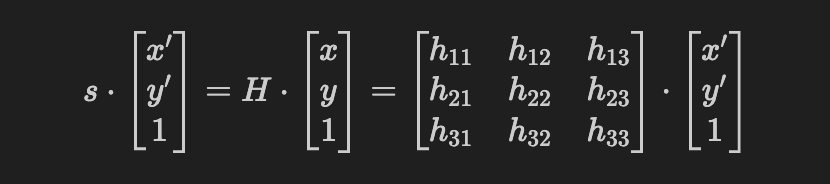

# Perspective Transform

## About Perspective Transform
Perspective Transform maps points from one plane to another using a 3×3 homography matrix. This transformation can rotate, translate, and scale an image to mimic real-world perspective. In our project, perspective transform is used to perform a geometric transformation to simulate a top-down (bird’s-eye) view of the scene.

### **How Perspective Transform Works**
Follow the following steps to achieve perspective transform:

1. Identify the region of interest
2. Compute the homography matrix using anchor points or camera parameters and pose
3. Apply the transform to each pixel by multiplying the homography matrix

### **What Is Homography Matrix**

A **homography matrix \( H \)** is a 3×3 matrix where it has 9 elements: h11, h12, ... , h33. The homography matrix can be defiend as a matrix that relates the transformation between two planes up to a scalar factor. Thus, when the coordinate pair (x, y) represents a point in original plane where (x', y') represents a point in transformed pair, following equation describes the relation between the two planes: 

<!--

$$
s \cdot
\begin{bmatrix}
x' \\
y' \\
1
\end{bmatrix}
=
H \cdot
\begin{bmatrix}
x \\
y \\
1
\end{bmatrix}

 = \begin{bmatrix}
h_{11} & h_{12} & h_{13} \\
h_{21} & h_{22} & h_{23} \\
h_{31} & h_{32} & h_{33}
\end{bmatrix}
\cdot
\begin{bmatrix}
x' \\
y' \\
1
\end{bmatrix}
$$

-->

Although homography matrix has 9 elements, it only has 8 degree of freedom. This is because the matrix is defined up to a scale. Thus scaling the entire matrix by any non-zero values will result in same transformation which makes one of the 9 parameter redundant (usually element h33 is set to 1).

source: https://medium.com/all-things-about-robotics-and-computer-vision/homography-and-how-to-calculate-it-8abf3a13ddc5

Here C and C' represents the two cameras and x, x', and X represents the points in camera 1's plane, camera 2's plane and world plane respectively. 

### **How to Compute Homography Matrix Using Relative Rotation and Translation**

When both planes (cameras) orientation and pose is known, homography matrix could be computed using relative rotation and translation between two planes. In order to do this, following parameters are required:

A **Intrinsic Matrix \( K \)** 

This matrix defines the internal parameters of the camera such as focal length, and optical center

$$
K =
\begin{bmatrix}
f_x & 0 & c_x \\
0 & f_y & c_y \\
0 & 0 & 1
\end{bmatrix}
$$

**fx, fy**: focal lengths in pixels along x and y axes
**cx, cy**: the principal point (usually center of image)

Note that there is no absolute intrinsic matrix even for the same camera. This can change for using different camera setting such as image resolution, zoom / focal length, and sensor readout setting. Calibration is recommended when camera setting changes.

A **Rotation Matrix \( R \)** 

This matrix defines the camera's orientation relative to the world

$$
R =
\begin{bmatrix}
r_{11} & r_{12} & r_{13} \\
r_{21} & r_{22} & r_{23} \\
r_{31} & r_{32} & r_{33}
\end{bmatrix}
$$

**r1j (1st column)**: Unit vector of x-axis of the camera in world coordinates (right)

**r2j (2nd column)**: The x-axis of the camera in world coordinates (right)

**r3j (3rd column)**: The x-axis of the camera in world coordinates (right)

A **Translation vector \( t \)** 

This vector defines the camera's position relative to the world. Often used with **Rotation Matrix \( R \)** to describe full orientation of the camera

$$
t =
\begin{bmatrix}
t_x\\
t_y\\
t_z
\end{bmatrix}
$$

**tx**: x-coordinate of camera in world coordinate system

**ty**: y-coordinate of camera in world coordinate system

**tz**: z-coordinate of camera in world coordinate system

**Plane Normal \( n \) and Distance \( d \)** 

$$
n =
\begin{bmatrix}
x \\
y \\
z
\end{bmatrix}, \quad
d = \text{distance from camera origin to plane in normal}
$$

**n** : Unit vector of normal of the plane

**Then using relative roation and translation between cameras, Homography Matrix (H) can be defined as**

**<pre> H = K · (R − (t · nᵀ) / d) · K⁻¹ </pre>**

### **How to Compute Homography Matrix Using Point Correspondences**

Point correspondence method is used to calculate the mapping between two images when the relative position of two views are unavailable. The point correspondences are the pair of corresponding points in the two images that are already known. Since the homography matrix has 8 degree of freedom, minimum of 4 pairs of corresponding points are required. 

**For each corresponding point x and x'**

$$
x =
\begin{bmatrix}
u \\
v \\
1
\end{bmatrix}, x' = \begin{bmatrix}
x \\
y \\
1
\end{bmatrix}
$$

** Hx = sx'**

Since, homography matrix is defined up to scale, scalar factor s could be removed. Then the equation Hx = sx' could be rewritten in the linear equation form of 

**Ah = 0**

Where:

$$
A =
\begin{bmatrix}
-x, -y, -1, 0, 0, 0, ux, uy, u \\
0, 0, 0, -x, -y, -1, vx, vy, v 
\end{bmatrix}
$$

$$
h =
\begin{bmatrix}
h_1\\
h_2\\
h_3\\
h_4\\
h_5\\
h_6\\
h_7\\
h_8\\
h_9
\end{bmatrix}
$$

h1 = h11, h2 = h12, h3 = h13, ... , h9 = h33

Then two linear equations could be formed as:

**<pre> -xh1 - -yh2 - h3 + uxh7 + uyh8 + uh9 = 0 </pre>**

and

**<pre> -xh4 - -yh5 - h6 + vxh7 + vyh8 + vh9 = 0 </pre>**

Thus, with 4 points of correspondences, all component of homography matrix, H could be computed

**More About Homography Matrix**

[Decomposition of Homography Matrix](https://inria.hal.science/inria-00174036v3/document)

[OpenCV Demonstration](https://docs.opencv.org/4.x/d9/dab/tutorial_homography.html?)

## Anchor Points

### What Are Anchor Points?

In terms of perspective transform, the anchor points refers to the specific known points in original image that are used to compute mapping to the corresponding points in destination image. These points serves as the correspondence points for calculating the transformation. These points must correspond to the planar surface (All points needs to correspond to the same physical plane). Generally, selecting a cornor or edges of a flat surface that span a large area is a good practices for selecting anchor points.

### How To Automate Selection of Anchor Point

**Feature Detection and Matching Algorithms**

This is the most common approach in computer vision for automatically selecting anchor points. These algorithms identify keypoints in an image — distinctive, local patterns like corners or blobs — and extract descriptors to match these keypoints across images.

- Scale-Invariant Feature Transform (SIFT)

- Oriented FAST and Rotated BRIEF (ORB)

- Accelerated-KAZE (AKAZE)

- Speeded-Up Robust Features (SURF)

**Marker-Based Detection**

These systems use known visual patterns (fiducials) to precisely identify and track corners or anchor points.

- ArUco Markers

- AprilTags

- Charuco Boards

**Edge and Contour Detection**

This is a geometric approach for finding anchor points — particularly useful for structured objects (documents, screens, signs).

- Canny Edge Detector

- Contour Detection + Polygon Approximation

**More About Anchor Point Selection**

[Fast Anchor Point Matching For Stitching](https://www.mdpi.com/1424-8220/20/7/2007?utm_source=chatgpt.com)

<!--
## Best Practices for Perspective Transform In General

## Depth Camera in Perspective Transform

### Could We Use It for Our Need?

### What Data Is Needed from Depth Camera

## How to Access the Data Needed from Depth Camera

### Commonly Used Practices with Depth Camera

## Machine Learning in Perspective Transform

-->