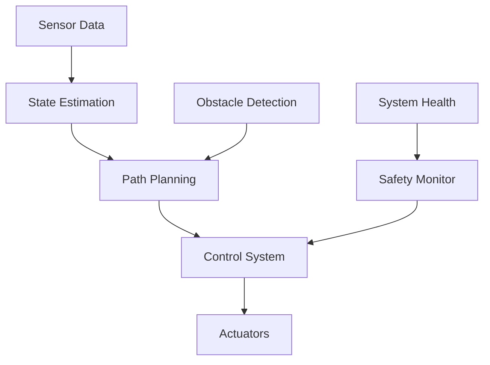
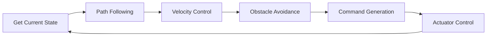
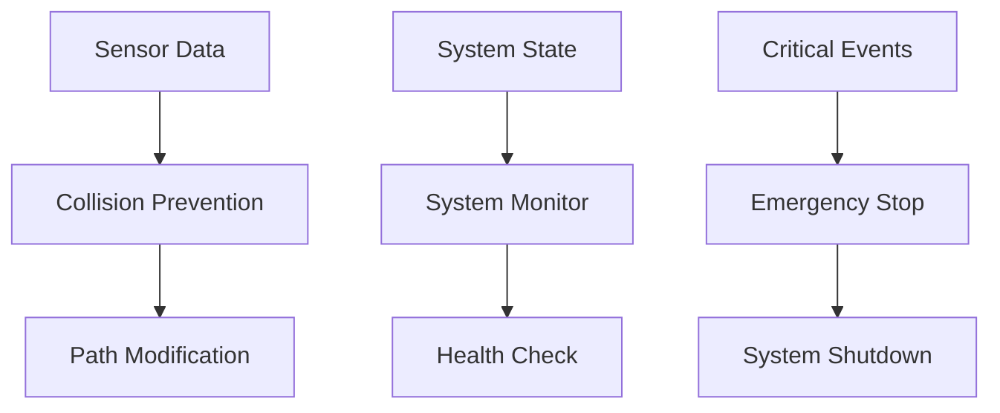
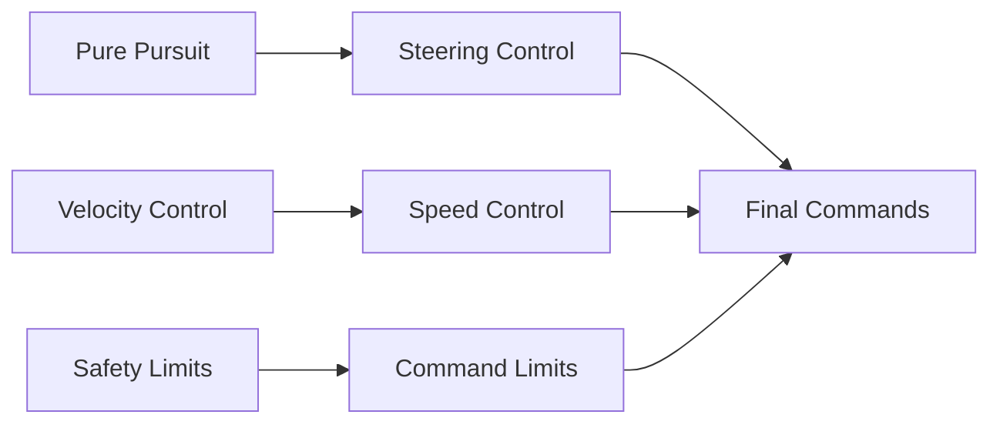
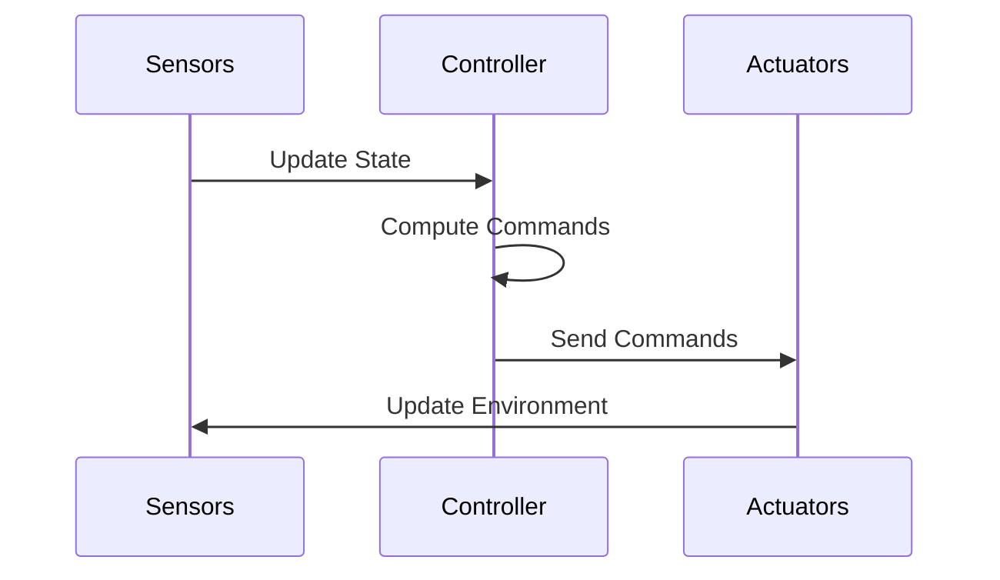

# Autonomous Control Documentation

## Table of Contents
1. [Overview](#overview)
2. [System Visualization](#system-visualization)
3. [Control Algorithms](#control-algorithms)
   - [Pure Pursuit Controller](#1-pure-pursuit-controller)
   - [Velocity Controller](#2-velocity-controller)
   - [Obstacle Avoidance](#3-obstacle-avoidance)
4. [Safety Features](#safety-features)
   - [Emergency Stop](#1-emergency-stop)
   - [Collision Prevention](#2-collision-prevention)
   - [System Monitoring](#3-system-monitoring)
5. [Performance Tuning](#performance-tuning)
   - [Controller Parameters](#1-controller-parameters)
   - [Safety Thresholds](#2-safety-thresholds)
   - [System Response](#3-system-response)
6. [Usage Guide](#usage-guide)
7. [Troubleshooting](#troubleshooting)

## Overview

The Autonomous Control system manages the car's movement and implements the racing strategy. It combines path following, velocity control, and obstacle avoidance to achieve safe and efficient autonomous racing.

## System Visualization

### Control System Architecture


### Control Loop Flow


### Safety System Architecture


### Control Parameter Relationships


### System Response Visualization


## Control Algorithms

### 1. Pure Pursuit Controller
The Pure Pursuit algorithm follows a precomputed racing line:

```cpp
class PurePursuitController {
public:
    double computeSteeringAngle(const Pose& current_pose, 
                               const Path& path) {
        // Find lookahead point
        Point lookahead = findLookaheadPoint(current_pose, path);
        
        // Calculate curvature
        double curvature = calculateCurvature(current_pose, lookahead);
        
        // Convert to steering angle
        return curvatureToSteering(curvature);
    }
    
private:
    double lookahead_distance_ = 1.0;  // meters
    double wheelbase_ = 0.3;           // meters
};
```

Key parameters:
- Lookahead distance
- Wheelbase
- Maximum steering angle
- Path smoothing

### 2. Velocity Controller
The velocity controller manages speed based on track conditions:

```cpp
class VelocityController {
public:
    double computeVelocity(const Pose& current_pose,
                          const Path& path,
                          const Obstacles& obstacles) {
        // Get current speed
        double current_speed = getCurrentSpeed();
        
        // Calculate target speed
        double target_speed = calculateTargetSpeed(current_pose, path);
        
        // Apply safety limits
        target_speed = applySafetyLimits(target_speed, obstacles);
        
        // Compute acceleration
        return computeAcceleration(current_speed, target_speed);
    }
};
```

Features:
- Speed profile following
- Acceleration/deceleration control
- Corner speed adjustment
- Obstacle-based speed reduction

### 3. Obstacle Avoidance
The obstacle avoidance system ensures safe navigation:

```cpp
class ObstacleAvoidance {
public:
    Path modifyPath(const Path& original_path,
                   const Obstacles& obstacles) {
        // Check for obstacles
        if (hasObstacles(obstacles)) {
            // Generate alternative path
            return generateAlternativePath(original_path, obstacles);
        }
        return original_path;
    }
    
private:
    double safety_margin_ = 0.5;  // meters
    double max_deviation_ = 1.0;  // meters
};
```

## Safety Features

### 1. Emergency Stop
The emergency stop system provides immediate response to critical situations:

```cpp
class EmergencyStop {
public:
    void checkEmergencyConditions() {
        if (isObstacleTooClose() || 
            isSystemUnstable() || 
            isCommunicationLost()) {
            triggerEmergencyStop();
        }
    }
    
private:
    void triggerEmergencyStop() {
        // Stop motors
        stopMotors();
        // Apply brakes
        applyBrakes();
        // Notify system
        notifyEmergency();
    }
};
```

### 2. Collision Prevention
The collision prevention system monitors and prevents potential collisions:

```cpp
class CollisionPrevention {
public:
    bool checkCollisionRisk(const Pose& current_pose,
                           const Obstacles& obstacles) {
        // Calculate time to collision
        double ttc = calculateTimeToCollision(current_pose, obstacles);
        
        // Check if risk is too high
        return ttc < safety_threshold_;
    }
    
private:
    double safety_threshold_ = 1.0;  // seconds
};
```

### 3. System Monitoring
Continuous monitoring of system health:

```cpp
class SystemMonitor {
public:
    void monitorSystem() {
        // Check sensor status
        checkSensors();
        // Monitor computation time
        checkComputationTime();
        // Verify communication
        checkCommunication();
        // Log system status
        logSystemStatus();
    }
};
```

## Performance Tuning

### 1. Controller Parameters
```yaml
pure_pursuit:
  # Pure Pursuit parameters
  lookahead_distance: 1.0
  min_lookahead: 0.5
  max_lookahead: 2.0
  lookahead_ratio: 0.1
  
  # Steering parameters
  max_steering_angle: 0.5
  steering_gain: 1.0
  steering_damping: 0.1
```

### 2. Safety Thresholds
```yaml
safety:
  # Emergency stop
  max_speed: 5.0
  max_acceleration: 3.0
  max_deceleration: 4.0
  
  # Collision prevention
  min_distance: 0.5
  time_to_collision: 1.0
  safety_margin: 0.3
```

### 3. System Response
```yaml
control:
  # Control loop
  update_rate: 100  # Hz
  max_latency: 0.1  # seconds
  
  # Response tuning
  acceleration_gain: 1.0
  deceleration_gain: 1.2
  steering_response: 0.8
```

## Usage Guide

### Basic Usage
```python
# Initialize controllers
pure_pursuit = PurePursuitController()
velocity_controller = VelocityController()
obstacle_avoidance = ObstacleAvoidance()

# Main control loop
while running:
    # Get current state
    current_pose = getCurrentPose()
    path = getCurrentPath()
    obstacles = getObstacles()
    
    # Compute control commands
    steering = pure_pursuit.computeSteeringAngle(current_pose, path)
    velocity = velocity_controller.computeVelocity(current_pose, path, obstacles)
    
    # Apply commands
    setSteering(steering)
    setVelocity(velocity)
```

### Advanced Usage
```python
# Custom control parameters
params = ControlParams(
    lookahead_distance=1.5,
    max_speed=4.0,
    safety_margin=0.4
)

# Initialize with custom parameters
controller = AutonomousController(params)

# Run with custom safety limits
controller.setSafetyLimits(
    max_acceleration=2.5,
    min_distance=0.6
)
```

## Troubleshooting

### Common Issues

1. **Overshooting in Turns**
   - Symptoms: Car takes wide turns
   - Solutions:
     - Reduce lookahead distance
     - Increase steering damping
     - Adjust path smoothing

2. **Unstable Speed Control**
   - Symptoms: Speed oscillates
   - Solutions:
     - Tune acceleration gains
     - Adjust speed profile
     - Check sensor readings

3. **Late Obstacle Response**
   - Symptoms: Slow reaction to obstacles
   - Solutions:
     - Increase update rate
     - Reduce safety margins
     - Improve obstacle detection

### Debugging Tools
```python
# Enable debug mode
controller.set_debug_mode(True)

# Monitor control signals
controller.monitor_signals()

# Log performance metrics
controller.log_metrics("control_metrics.csv")
``` 