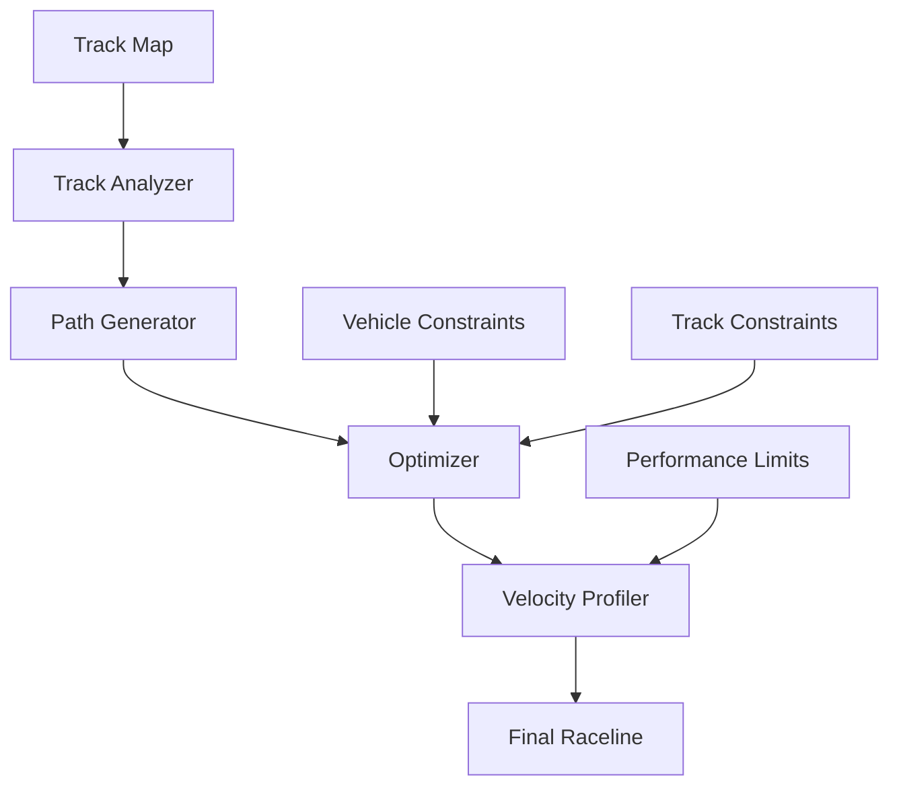
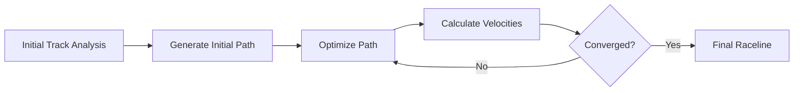
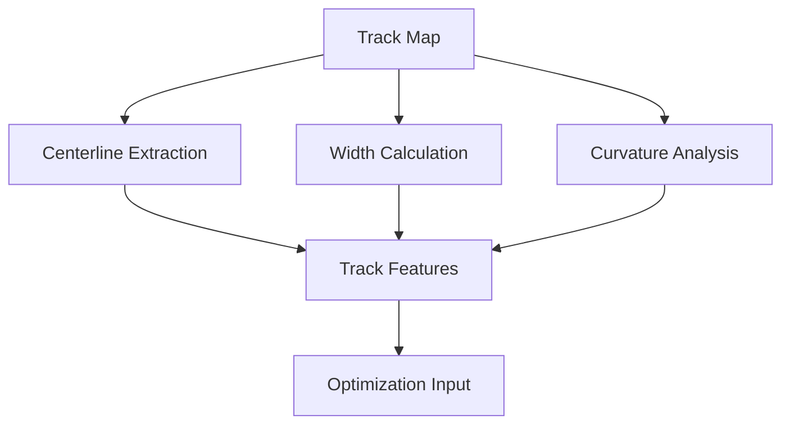
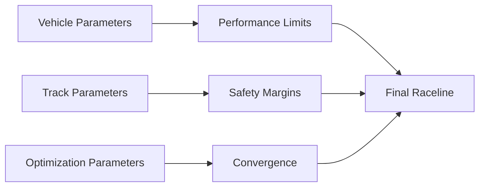

# Raceline Optimization Documentation

## Table of Contents
1. [Overview](#overview)
2. [System Visualization](#system-visualization)
3. [Algorithm Details](#algorithm-details)
   - [Track Analysis](#1-track-analysis)
   - [Optimization Process](#2-optimization-process)
   - [Constraints](#3-constraints)
4. [Parameter Tuning](#parameter-tuning)
   - [Optimization Parameters](#1-optimization-parameters)
   - [Vehicle Parameters](#2-vehicle-parameters)
   - [Track Parameters](#3-track-parameters)
5. [Performance Considerations](#performance-considerations)
   - [Computational Requirements](#1-computational-requirements)
   - [Optimization Speed](#2-optimization-speed)
   - [Memory Usage](#3-memory-usage)
6. [Usage Guide](#usage-guide)
7. [Troubleshooting](#troubleshooting)

## Overview

The Raceline Optimization system computes optimal racing lines for the autonomous race car. It takes into account track geometry, vehicle dynamics, and racing objectives to generate trajectories that maximize speed while maintaining safety.

## System Visualization

### System Architecture


### Optimization Process Flow


### Track Analysis Visualization


### Parameter Relationships


## Algorithm Details

### 1. Track Analysis
The system first analyzes the track to identify key features:
```python
class TrackAnalyzer:
    def __init__(self, track_map):
        self.track_map = track_map
        self.centerline = self.extract_centerline()
        self.track_width = self.calculate_track_width()
        self.curvature = self.compute_curvature()
```

Key features extracted:
- Track centerline
- Track width
- Curvature profile
- Banking angles
- Surface conditions

### 2. Optimization Process
The optimization uses a combination of techniques:

1. **Initial Path Generation**
   ```python
   def generate_initial_path(self):
       # Generate initial racing line using minimum curvature
       path = self.minimum_curvature_path()
       # Smooth the path
       path = self.smooth_path(path)
       return path
   ```

2. **Iterative Optimization**
   ```python
   def optimize_raceline(self, initial_path):
       for iteration in range(max_iterations):
           # Update velocities
           velocities = self.velocity_profile(path)
           # Optimize path
           path = self.optimize_path(path, velocities)
           # Check convergence
           if self.check_convergence(path):
               break
       return path, velocities
   ```

### 3. Constraints
The optimization considers several constraints:

1. **Vehicle Dynamics**
   ```python
   class VehicleConstraints:
       def __init__(self):
           self.max_lateral_accel = 2.0  # m/s²
           self.max_longitudinal_accel = 3.0  # m/s²
           self.max_steering_angle = 0.5  # rad
   ```

2. **Track Boundaries**
   ```python
   def check_track_constraints(self, path):
       for point in path:
           if not self.is_within_track(point):
               return False
       return True
   ```

## Parameter Tuning

### 1. Optimization Parameters
```yaml
raceline_optimization:
  # General parameters
  max_iterations: 1000
  convergence_threshold: 0.001
  
  # Path optimization
  smoothing_weight: 0.1
  curvature_weight: 0.5
  acceleration_weight: 0.3
  
  # Velocity optimization
  max_velocity: 5.0  # m/s
  min_velocity: 0.5  # m/s
  velocity_smoothing: 0.2
```

### 2. Vehicle Parameters
```yaml
vehicle:
  # Physical parameters
  mass: 3.0  # kg
  wheelbase: 0.3  # m
  track_width: 0.2  # m
  
  # Performance limits
  max_lateral_accel: 2.0  # m/s²
  max_longitudinal_accel: 3.0  # m/s²
  max_steering_angle: 0.5  # rad
```

### 3. Track Parameters
```yaml
track:
  # Track characteristics
  width: 2.0  # m
  banking_angle: 0.0  # rad
  surface_friction: 0.8
  
  # Optimization settings
  min_turn_radius: 0.5  # m
  safety_margin: 0.2  # m
```

## Performance Considerations

### 1. Computational Requirements
- Time complexity: O(n * m * k)
  - n = number of path points
  - m = number of iterations
  - k = number of constraints
- Space complexity: O(n)

### 2. Optimization Speed
Optimization strategies:
1. **Parallel Processing**
   ```python
   def parallel_optimize(self):
       with Pool() as pool:
           results = pool.map(self.optimize_segment, self.track_segments)
   ```

2. **Early Termination**
   ```python
   def check_convergence(self, path):
       if self.improvement < self.threshold:
           return True
       return False
   ```

### 3. Memory Usage
Memory optimization techniques:
- Use sparse matrices for large tracks
- Implement efficient data structures
- Clear intermediate results

## Usage Guide

### Basic Usage
```python
# Initialize optimizer
optimizer = RacelineOptimizer(track_map, vehicle_params)

# Generate optimal racing line
raceline, velocities = optimizer.optimize()

# Save results
optimizer.save_raceline("optimal_raceline.csv")
```

### Advanced Usage
```python
# Custom optimization parameters
params = OptimizationParams(
    max_iterations=2000,
    convergence_threshold=0.0005,
    smoothing_weight=0.15
)

# Run optimization with custom parameters
raceline = optimizer.optimize(params)
```

## Troubleshooting

### Common Issues

1. **Poor Convergence**
   - Symptoms: Optimization doesn't converge
   - Solutions:
     - Increase max_iterations
     - Adjust convergence_threshold
     - Check constraint parameters

2. **Unrealistic Velocities**
   - Symptoms: Generated velocities exceed vehicle capabilities
   - Solutions:
     - Verify vehicle parameters
     - Adjust acceleration limits
     - Check track constraints

3. **Track Boundary Violations**
   - Symptoms: Racing line crosses track boundaries
   - Solutions:
     - Increase safety_margin
     - Adjust smoothing parameters
     - Verify track map accuracy

### Debugging Tools
```python
# Enable debug logging
optimizer.set_debug_level(DEBUG)

# Visualize optimization process
optimizer.visualize_iterations()

# Export optimization metrics
optimizer.export_metrics("optimization_metrics.csv")
``` 